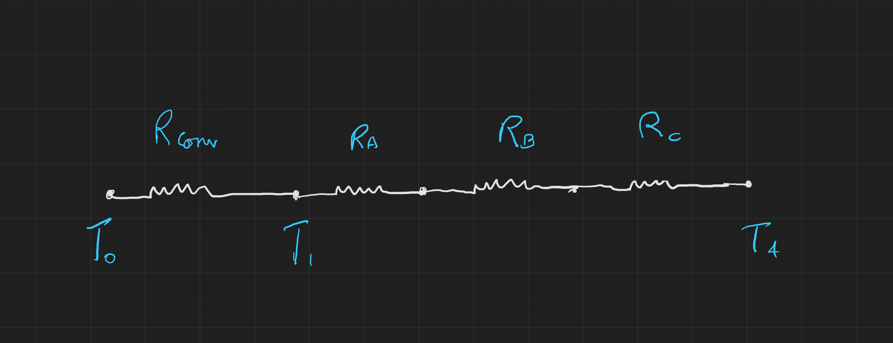

\newpage
# Pset1

*Name: Divy Chandra*

*Cohort: SC06*

*Student ID: 1005246*

---

## **Problem 1**

First Law: $\dot{E}_{sys} = \dot{Q}_{in} - \dot{Q}_{out} + \dot{W}_{in} - \dot{W}_{out} + \Delta \dot{E}_{flow}$

In the given problem,

$\dot{Q}_{in} = \dot{Q}_{H}, \;\;\;\; \dot{Q}_{out} = \dot{Q}_{C}$

$\dot{W}_{out} = \dot{W}, \;\;\;\; \dot{W}_{in} = 0$

$\Delta \dot{E}_{flow} = 0, \;\; \dot{E}_{sys} = 0$

### a)
$\dot{E}_{sys} = (500 - 300) + (0 - 200) + 0 = 0$

$\color{blue}\text{Therefore, the first law holds}$

### b)
$\dot{E}_{sys} = (400 - 120) + (0 - 280) + 0 = 0$

$\color{blue}\text{Therefore, the first law holds}$

### c)
$\dot{E}_{sys} = (650 - 500) + (0 - 300) + 0 = -150 \neq 0$

$\color{blue}\text{Therefore, the first law does not hold}$

### d)
$\dot{E}_{sys} = (200 - 800) + (0 - 600) + 0 = -1200 \neq 0$

$\color{blue}\text{Therefore, the first law does not hold}$

\newpage
## **Problem 2**

In the given problem,

$\kappa_A = 20 \; W/m.K, \;\;\;\;\; L_A = 0.30 m$

$\kappa_B = \; ? \; W/m.K, \;\;\;\;\;\; L_B = 0.15 m$

$\kappa_C = 50 \; W/m.K, \;\;\;\; L_C = 0.15 m$

$T_0 = 800^{\circ}C, \;\;\;\;\;\;\;\;\;\;\;\;\; T_1 = 600^{\circ}C, \;\;\;\;\;\; T_4 = 20^{\circ}C$

$h = 25 \; W/m^2 . K, \;\;\;\; A = 2 m^2$

### a)

### b)
$\dot{Q} = h A (T_h - T_c) = 25 \times 2 (800 - 600) = 10,000 W$

$R_A = \cfrac{L_A}{\kappa_A A} = \cfrac{0.3}{20 \times 2} = 0.0075 K/W$

$R_B = \cfrac{L_B}{\kappa_B A} = \cfrac{0.15}{\kappa_B \times 2} = \cfrac{0.075}{\kappa_B}K/W$

$R_C = \cfrac{L_C}{\kappa_C A} = \cfrac{0.15}{50 \times 2} = 0.0015 K/W$

$R_{conv} = \cfrac{1}{h A} = \cfrac{1}{25 \times 2} = 0.02 K/W$

$R_{total, condution} = R_A+R_B+R_C = (0.009 + \cfrac{0.075}{\kappa_B})K/W$

$\dot{Q} = \cfrac{\Delta T}{R_{total, conduction}}$

$10,000 = \cfrac{600-20}{0.009 + \cfrac{0.075}{\kappa_B}}$

On solving this equation, $\color{blue}\kappa_B = 1.53 W/m.K$

### c)
$R_{total} = R_{conv}+R_A+R_B+R_C = 0.02 + (0.009 + \cfrac{0.075}{1.53})K/W = 0.078K/W$

$\color{blue}R_{total} = 0.078K/W$

\newpage
## **Problem 3**

$T_1 = 1400K, \;\;\;\; P_1 = 20 \; bar$

$T_2 = 1100K, \;\;\;\; P_2 = 5 \; bar$

$T_3 = \; ? \; K, \;\;\;\; P_3 = 4.5 \; bar$

$T_4 = 980K, \;\;\;\; P_4 = 1 \; bar$

$T_5 = 1480K, \;\;\;\; P_5 = 1.35 \; bar, \;\;\;\; m_5 = 1200 kg/min$

$T_6 = 1200K, \;\;\;\; P_6 = 1 \; bar$

### a)

In the given problem, for the state going from 5 to 6:

$\dot{E}_{sys} = \Delta \dot{Q} + \Delta \dot{W} + \Delta \dot{E}_{flow}$

$\dot{E}_{sys} = 0 W, \;\;\;\; \Delta \dot{Q} = \Delta \dot{Q}_{5, 6}, \;\;\;\; \Delta \dot{W} = 0 W, \;\;\;\; \dot{E}_{flow} = \dot{m}(h_5 - h_6)$

$\dot{m} = 20 kg/s, \;\;\;\; h_5 = 1611.79 kJ/kg. K, \;\;\;\; h_6 = 1277.79 kJ/kg. K$

$0 = \Delta \dot{Q}_{5, 6} + 0 + 20(1611.79 - 1277.79)$

$\Delta \dot{Q}_{5, 6} = -6680 kW$

In the given problem, for the state going from 1 to 2:

$\dot{E}_{sys} = \Delta \dot{Q} + \Delta \dot{W} + \Delta \dot{E}_{flow}$

$\dot{E}_{sys} = 0 W, \;\;\;\; \Delta \dot{Q} = 0 W, \;\;\;\; \Delta \dot{W} = -10,000 KW, \;\;\;\; \dot{E}_{flow} = m(h_1 - h_2)$

$h_1 = 1515.42 kJ/kg. K, \;\;\;\; h_2 = 1161.07 kJ/kg. K$

$0 = 0 - 10000 + m(1515.42 - 1161.07)$

$m = 28.22$

In the given problem, for the state going from 2 to 3:

$\dot{E}_{sys} = \Delta \dot{Q} + \Delta \dot{W} + \Delta \dot{E}_{flow}$

$\dot{E}_{sys} = 0, \;\;\;\; \Delta \dot{Q} = \Delta \dot{Q}_{5, 6} = 6680, \;\;\;\; \Delta \dot{W} = 0, \;\;\;\; \dot{E}_{flow} = 28.22(h_2 - h_3)$

$h_2 = 1161.07 kJ/kg. K$

$0 = 6680 + 28.22(1161.07 - h_3)$

$h_3 = 1397.78$

$=> \color{blue}T_3 = 1301.52 K$

### b)

In the given problem, for the state going from 3 to 4:

$\dot{E}_{sys} = \Delta \dot{Q} + \Delta \dot{W} + \Delta \dot{E}_{flow}$

$\dot{E}_{sys} = 0, \;\;\;\; \Delta \dot{Q} = 0, \;\;\;\; \Delta \dot{W} = 0, \;\;\;\; \dot{E}_{flow} = 28.22(h_3 - h_4)$

$h_3 = 1397.78 kJ/kg. K, h_4 = 1023.25 kJ/kg. K$

$0 = 0 + \Delta \dot{W} + 28.22(1397.78 - 1023.25)$

$\color{blue}\dot{W}_{out} = 10569.24 kW$