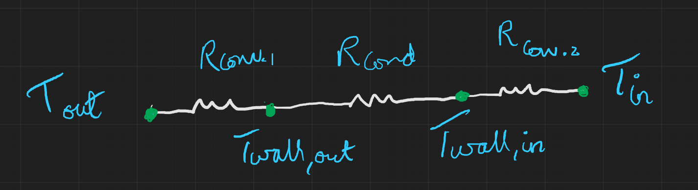

\newpage
# Pset2

*Name: Divy Chandra*

*Cohort: SC06*

*Student ID: 1005246*

---

## **Problem 1**

### a)

From Pset 1 Q3:

$\Delta \dot{Q}_{5, 6} = -6680 \; kW, \;\;\;\; \Delta \dot{W}_{5, 6} = 0 \; W$

$\Delta \dot{Q}_{2, 3} = 6680 \; kW, \;\;\;\;\;\;\; \Delta \dot{W}_{2, 3} = 0 \; W$

$\Delta \dot{Q}_{1, 2} = 0 \; kW, \;\;\;\;\;\;\;\;\;\;\;\; \Delta \dot{W}_{1, 2} = -10,000 \; kW$

$\Delta \dot{Q}_{3, 4} = 0 \; kW, \;\;\;\;\;\;\;\;\;\;\;\; \Delta \dot{W}_{3, 4} = 10569.24 \; kW$

Using the Entropy balance for all the above stages, one by one:
$\cfrac{dS_{sys}}{dt} = \cfrac{\dot{Q}_{in}}{T_{in}} - \cfrac{\dot{Q}_{out}}{T_{out}} + \dot{m}(s_i - s_e) + \dot{\sigma}_{gen}$

For the state going from 5 to 6:

$\dot{Q}_{in} = 0 W, \;\;\;\; \dot{Q}_{out} = 0 kW$

$\dot{T}_{in} = 1480 K, \;\;\;\; \dot{T}_{out} = 1200 K$

$s_5^{\circ} = 3.42892 \; kJ/kg.K \;\;\;\; s_6^{\circ} = 3.17888 \; kJ/kg.K$

After applying the pressure correction for specific entropy:

$s_5 = 3.3428 \; kJ/kg.K \;\;\;\; s_6 = 3.17888 \; kJ/kg.K$

$\dot{m} = 20 kg/s$

$0 = 20(3.3428 - 3.17888) + \dot{\sigma}_{gen}$

$\color{purple}\dot{\sigma}_{gen} = -3.28 \; kJ/s.K$

(even though this value is negative, the total entropy generation for the heat exchanger is positive)

For the state going from 2 to 3:

$\dot{Q}_{in} = 0 kW, \;\;\;\; \dot{Q}_{out} = 0 kW$

$\dot{T}_{in} = 1100 K, \;\;\;\; \dot{T}_{out} = 1301.52 K$

$s_2^{\circ} = 3.07732 \; kJ/kg.K \;\;\;\; s_3^{\circ} = 3.2748294 \; kJ/kg.K$

After applying the pressure correction for specific entropy:

$s_2 = 2.6154 \; kJ/kg.K \;\;\;\; s_3 = 2.8432 \; kJ/kg.K$

$\dot{m} = 28.22 kg/s$

$0 = 28.22(2.6154 - 2.8432) + \dot{\sigma}_{gen}$

$\color{purple}\dot{\sigma}_{gen} = 6.43 \; kJ/s.K$

Total entropy generated for the heat exchanger:

$\color{purple}\dot{\sigma}_{gen} = 6.43 - 3.28 = 3.15 kJ/s.K$

For Turbine 1 (state 1 to 2):

$\dot{Q}_{in} = 0 W, \;\;\;\; \dot{Q}_{out} = 0 kW$

$\dot{T}_{in} = 1400 K, \;\;\;\; \dot{T}_{out} = 1100 K$

$s_1^{\circ} = 3.36200 \; kJ/kg.K \;\;\;\; s_2^{\circ} = 3.07732 \; kJ/kg.K$

After applying the pressure correction for specific entropy:

$s_1 = 2.5022 \; kJ/kg.K \;\;\;\; s_2 = 2.6154 \; kJ/kg.K$

$\dot{m} = 28.22 kg/s$

$0 = \cfrac{0}{1400} - \cfrac{0}{1100} + 28.22(2.5022 - 2.6154) + \dot{\sigma}_{gen}$

$\color{purple}\dot{\sigma}_{gen} = 3.19 kJ/s.K$

For Turbine 2 (state 3 to 4):

$\dot{Q}_{in} = 0 W, \;\;\;\; \dot{Q}_{out} = 0 kW$

$\dot{T}_{in} = 1301.52 K, \;\;\;\; \dot{T}_{out} = 980 K$

$s_3^{\circ} = 3.2748294 \; kJ/kg.K \;\;\;\; s_4^{\circ} = 2.94468 \; kJ/kg.K$

After applying the pressure correction for specific entropy:

$s_3 = 2.8432 \; kJ/kg.K \;\;\;\; s_4 = 2.94468 \; kJ/kg.K$

$\dot{m} = 28.22 kg/s$

$0 = \cfrac{0}{1301.52} - \cfrac{0}{980} + 28.22(2.8432 - 2.94468) + \dot{\sigma}_{gen}$

$\color{purple}\dot{\sigma}_{gen} = 2.86 kJ/s.K$

\newpage

$\color{blue}\text{Entropy Generated from the heat exchanger (he)} = \dot{\sigma}_{gen, he} = 3.15 kJ/s.K$

$\color{blue}\text{Entropy Generated from Turbine 1 (t1)} \;\;\;\;\;\;\;\;\;\;\;\;\;\; = \dot{\sigma}_{gen, t1} = 3.19 kJ/s.K$

$\color{blue}\text{Entropy Generated from Turbine 2 (t2)} \;\;\;\;\;\;\;\;\;\;\;\;\;\; = \dot{\sigma}_{gen, t2} = 2.86 kJ/s.K$

### b)

The most inefficient component is the one that generates the most entropy. In decreasing order of amount of entropy generated (going from least efficient to most efficient), the components are:

$\color{blue}\text{Turbine 1, Heat Exchanger, Turbine 2}$

\newpage

## **Problem 2**

$T_{out} = 0^{\circ}C, \;\;\;\; T_{wall, out} = 5^{\circ}C, \;\;\;\; T_{wall, in} = 20^{\circ}C, \;\;\;\; T_{in} = 27^{\circ}C$

$L = 0.3 m, \;\;\;\; A = 30 m^2, \;\;\;\; \dot{Q} = 1035 W$

### a)

$\Delta\dot{X}_{work} = 0 kW$

$\dot{X}_{heat, in} = (1 - \cfrac{T_0}{T})\dot{Q} = (1 - \cfrac{273}{293})1035 = 70.65 kW$

$\dot{X}_{heat, in} = (1 - \cfrac{T_0}{T})\dot{Q} = (1 - \cfrac{273}{278})1035 = 18.62 kW$

$\Delta\dot{X} = \Delta\dot{X}_{heat} + \Delta\dot{X}_{work} - \dot{X}_{destroyed}$

$0 = 70.65 - 18.62 - \dot{X}_{destroyed}$

$\color{blue}\dot{X}_{destroyed} = 52.03 kW$

### b)

$\Delta\dot{X}_{work} = 0 kW$

$\Delta\dot{X}_{heat} = (1 - \cfrac{T_0}{T})\dot{Q} = (1 - \cfrac{273}{300})1035 = 93.15 kW$

(There is no $X_{out}$ here, only $X_{in}$)

$\Delta\dot{X} = \Delta\dot{X}_{heat} + \Delta\dot{X}_{work} - \dot{X}_{destroyed}$

$0 = 93.15 - \dot{X}_{destroyed}$

$\color{blue}\dot{X}_{destroyed} = 93.15 kW$

### c)

The exergy destroyed in the entire process is more than just the exergy destroyed during the conduction through the wall because it includes two additional convection processes that contribute to the total exergy destroyed which are not taken into account for heat transfer through just the wall. Thermal resistivity diagram:

\newpage

## **Problem 3**

From [Problem 1](#problem-1)

$\dot{\sigma}_{gen, he} = 3.15 = kJ/s.K$

$\dot{\sigma}_{gen, t1} = 3.19 kJ/s.K$

$\dot{\sigma}_{gen, t2} = 2.86 kJ/s.K$

### a)

$\dot{X}_{destroyed, he} = T_0 \dot{\sigma}_{gen, he} = 300 \times 3.15 = 945 \; kW$

$\dot{X}_{destroyed, t1} = T_0 \dot{\sigma}_{gen, t1} = 300 \times 3.19 = 957 \; kW$

$\dot{X}_{destroyed, t2} = T_0 \dot{\sigma}_{gen, t2} = 300 \times 2.86 = 858 \; kW$

$\color{blue}\dot{X}_{destroyed, he} = 945 \; kW$

$\color{blue}\dot{X}_{destroyed, t1} = 957 \; kW$

$\color{blue}\dot{X}_{destroyed, t2} = 858 \; kW$

### b)

$\epsilon = 1 - \cfrac{\dot{X}_{destroyed}}{\dot{X}_{supplied}}$

$X_{supplied} = m(\psi_{in} - \psi_{out})$

$X_{supplied} = m((h_{in} - h_{out}) - T_0(s_{in} - s_{out}))$

For Turbine 1 (The state going from 1 to 2):

$s_1^{\circ} = 3.36200 \; kJ/kg.K \;\;\;\; s_2^{\circ} = 3.07732 \; kJ/kg.K$

After applying the pressure correction for specific entropy:

$s_1 = 2.5022 \; kJ/kg.K \;\;\;\; s_2 = 2.6154 \; kJ/kg.K$

$h_1 = 1515.42 \; kJ/kg \;\;\;\; h_2 = 1161.07 \; kJ/kg$

$X_{supplied} = 28.22((1515.42 - 1161.07) - 300(2.5022 - 2.6154)) = 10958.1082 \; kW$

$\epsilon_1 = 1 - \cfrac{957}{10958.1082} = 0.91$

$\color{purple}\epsilon_1 = 0.91$

For Turbine 2 (The state going from 3 to 4):

$s_3^{\circ} = 3.2748294 \; kJ/kg.K \;\;\;\; s_4^{\circ} = 2.94468 \; kJ/kg.K$

After applying the pressure correction for specific entropy:

$s_3 = 2.8432 \; kJ/kg.K \;\;\;\; s_4 = 2.94468 \; kJ/kg.K$

$h_3 = 1397.77804 \; kJ/kg \;\;\;\; h_4 = 1023.25 \; kJ/kg$

$X_{supplied} = 28.22((1397.77804 - 1023.25) - 300(2.8432 - 2.94468)) = 11428.31 \; kW$

$\epsilon_2 = 1 - \cfrac{858}{11428.31} = 0.92$

$\color{purple}\epsilon_2 = 0.92$

$\color{blue} \text{Efficiency of Turbine 1} = \epsilon_1 = 0.91$

$\color{blue} \text{Efficiency of Turbine 2} = \epsilon_2 = 0.92$

### c)

For Heat Exchanger (The state going from 5 to 6):

$s_5^{\circ} = 3.42892 \; kJ/kg.K \;\;\;\; s_6^{\circ} = 3.17888 \; kJ/kg.K$

After applying the pressure correction for specific entropy:

$s_5 = 3.3428 \; kJ/kg.K \;\;\;\; s_6 = 3.17888 \; kJ/kg.K$

$h_5 = 1611.79 \; kJ/kg \;\;\;\; h_6 = 1277.79 \; kJ/kg$

$X_{supplied} = 20((1611.79 - 1277.79) - 300(3.3428 - 3.17888)) = 5696.48 \; kW$

$\epsilon_{he} = 1 - \cfrac{945}{5696.48} = 0.83$

$\color{blue} \text{Efficiency of the heat exchanger} = \epsilon_{he} = 0.83$

### d)

For the overall system,

Total $X_{destroyed} = 945 + 958 + 858 = 2761 \; kW$

$X_{supplied} = X_{supplied, process} + X_{supplied, he} \; kW$

$X_{supplied} = \dot{m}(h_1 - h_4 - T_0(s_1 - s_4)) + X_{supplied, he} \; kW$

$X_{supplied} = 28.22(1515.42 - 1023.25 - 300(2.5022 - 2.94468)) + 5696.48 = 23331.55 \; kW$

$\epsilon = 1 - \cfrac{2761}{23331.55} = 0.88$

$\color{blue} \text{Efficiency} = \epsilon = 0.88$