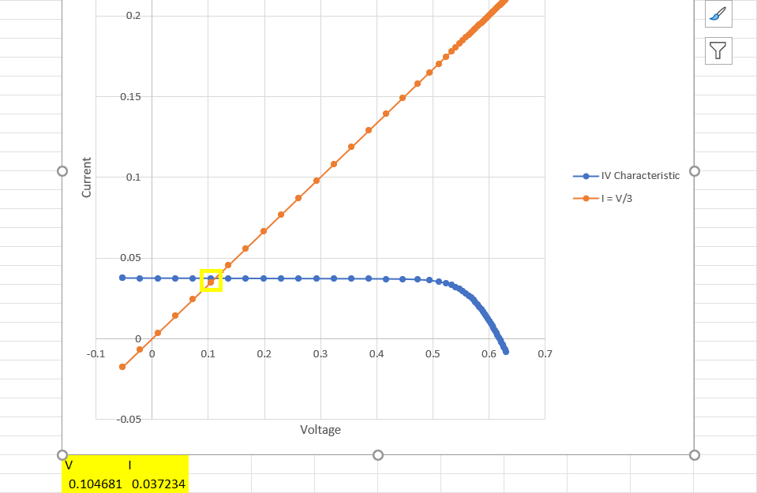
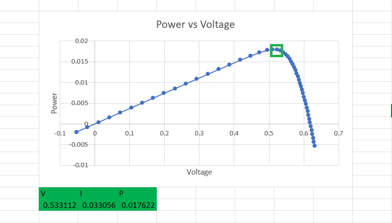

\newpage
# Pset4

*Name: Divy Chandra*

*Cohort: SC06*

*Student ID: 1005246*

---

## **Problem 1**

Two types of solar cells are:

1. Monocrystalline

    Advantage: They are the most efficient solar panels, with an efficiency of about (15% - 20%)

    Disadvantage: They are quite expensive

2. Polycrystalline

    Advantage: They are cheaper and easier to produce than monocrystalline solar panels

    Disadvantage: Their efficiency is lower than that of monocrystalline cells (13% - 16%)

## **Problem 2**

It is known that $I_o$ (the reverse saturation current) is directly proportional to the intensity of light incident on the solar panel.

Also note that:

$I_{sc} = I_o(e^{\cfrac{eV}{k_B T}} - 1)$

$V_{oc} = \cfrac{K_B T}{e} ln\left(\cfrac{I_{sc}}{I_o} + 1\right)$

From the first formula, we note that $I_{sc}$ is proportional to the $I_o$ which implies that it is also proportional to the intensity of light incident on the solar panel.

Hence, when the light intensity is doubled, we get the new $I_{sc} = 300 mA$

Using the first formula in the second formula, we can write:

$I_{sc} = I_o(e^{\cfrac{qV}{k_B T}} - 1)$

$\cfrac{I_{sc}}{I_o} = e^{\cfrac{qV}{k_B T}} - 1$

For $500 W/m^2$, we have:

$\cfrac{0.15}{I_o} = e^{\cfrac{e 0.53}{k_B T}} - 1$

For $1000 W/m^2$, we have:

$\cfrac{0.3}{I_o} = e^{\cfrac{qV_{oc}}{k_B T}} - 1$

Dividing the two equations:

$\cfrac{1}{2} = \cfrac{e^{\cfrac{q 0.53}{k_B T}} - 1}{e^{\cfrac{qV_{oc}}{k_B T}} - 1}$

$e^{\cfrac{qV_{oc}}{k_B T}} - 1 = 2 \times e^{\cfrac{q 0.53}{k_B T}} - 2$

$e^{\cfrac{qV_{oc}}{k_B T}} = 2 \times e^{\cfrac{q 0.53}{k_B T}} - 1$

Log on both sides:

$\cfrac{qV_{oc}}{k_B T} = ln\left( 2 \times e^{\cfrac{q 0.53}{k_B T}} - 1 \right)$

we know that $q = 1.6 \times 10^{-19} C$ and $K_B T = 4.149 \times 10^{-21} J$. Using these values, we calculate and simplify the above expression to:

$38.56 V_{oc} = 21.13$

$\color{blue} V_{oc} = 0.548 V$

$\color{blue} I_{sc} = 300 mA$

\newpage

## **Problem 3**

### i)

From the graph above,

$\color{blue} V = 0.104681 V$
$\color{blue} I = 0.037234 A$

### ii)

$P = 0.104681 \times 0.037234 W$

$\color{blue} P = 0.0039 W$

### iii)

$\% Conversion = \cfrac{P_{delivered}}{P_{incident}} \times 100\% = \cfrac{0.0039}{1000 \times 10^{-4}} \times 100\%$

$\color{blue} \% Conversion = 3.9 \%$

\newpage

### iv)

From the graph above,

$\color{blue} P_{max} = 0.0176 W$

### v)

$V_{oc} = 0.62 V$

$I_{sc} = 0.037 A$

$FF = \cfrac{P_{max}}{V_{oc} I_{sc}} = \cfrac{0.0176}{0.62 \times 0.037}$

$\color{blue} FF = 0.767$

### vi)

$\eta = \cfrac{P_{max}}{P_{in}} = {0.0176}{0.1}$

$\color{blue} \eta = 0.176$